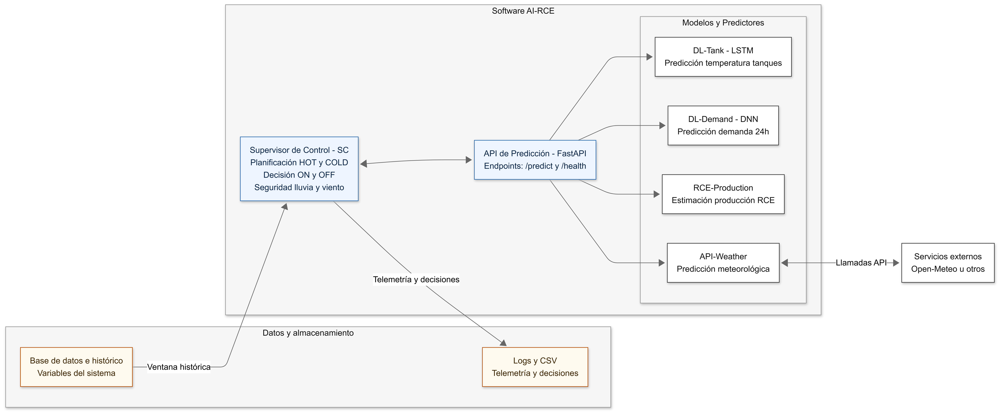

# AI-RCE — Control predictivo para sistemas híbridos basados en Radiative Collector and Emitter (RCE)

Repositorio de software para **predicción, supervisión y control inteligente** de un sistema híbrido basado en el concepto **RCE (Radiative Collector and Emitter)**, desarrollado en el marco del proyecto estatal **BOOST-RCE (TED2021-131446B-I00)**.

---

## Contexto del proyecto BOOST-RCE

El proyecto **BOOST-RCE** ha permitido optimizar el rendimiento del concepto innovador **RCE (Radiative Collector and Emitter)**, un sistema capaz de generar **calor y frío durante las 24 horas del día** con **emisiones de CO₂ nulas**. El RCE combina **captación solar térmica diurna** y **enfriamiento radiativo nocturno** para producir energía térmica por encima o por debajo de la temperatura ambiente, respectivamente.

Sus principales ventajas competitivas incluyen la **doble generación de energía renovable**, la **modularidad**, la **escalabilidad** y la **capacidad de integración con sistemas convencionales de climatización**, contribuyendo a incrementar la eficiencia energética y a reducir tanto el consumo como las emisiones asociadas.

Con el fin de maximizar la producción de frío nocturno, el sistema incorpora una **cubierta de polietileno de baja densidad (30 μm)** con elevada transmitancia en la **ventana atmosférica infrarroja (7–14 μm)**, donde la atmósfera presenta alta transparencia. Asimismo, se ha desarrollado un **sistema de control lógico inteligente** capaz de optimizar la operación diurna y nocturna. Este sistema compara las **predicciones de producción y demanda** y gestiona la activación de una **cubierta móvil de vidrio** en función de las condiciones ambientales y operativas, con el objetivo de **minimizar el consumo energético** e identificar los **intervalos de máxima eficiencia**.

Los ensayos realizados muestran que el RCE es capaz de alcanzar **temperaturas de agua entre 7,4 °C y 8,1 °C por debajo de la temperatura ambiente**. Paralelamente, los **modelos de predicción basados en técnicas de Deep Learning** han sido validados, proporcionando estimaciones precisas de producción y demanda, lo que permite **optimizar la operación futura del sistema** e identificar escenarios de mayor rendimiento.

Los resultados del proyecto evidencian que el RCE posee un **alto potencial para reducir el consumo de combustibles fósiles y el uso de agua**, así como para mejorar la **seguridad del suministro energético**. Su carácter distribuido disminuye las pérdidas por transporte y contribuye a la estabilidad de precios. En conjunto, el sistema RCE constituye una **tecnología limpia** que mejora el confort térmico, fortalece la sostenibilidad y amplía las posibilidades tecnológicas en los sectores de **climatización y energías renovables**.

---

## Descripción del software

Este repositorio implementa un **sistema de control predictivo basado en Machine Learning** que permite:

- Predecir la **producción térmica (frío/calor)** del sistema RCE.
- Predecir la **demanda energética** del edificio.
- Incorporar **predicciones meteorológicas** relevantes.
- Tomar decisiones automáticas de operación mediante un **Supervisor de Control (SC)**.
- Integrarse con un **PLC Siemens** para la operación del prototipo experimental.

El software ha sido validado sobre un **sistema RCE real**, combinando modelos de Deep Learning con control lógico industrial.

---

## Arquitectura del sistema

```
Sensores / PLC / Base de datos
            ↓
   Supervisor de Control (SC)
            ↓
      API de Predicción
   (FastAPI + Modelos ML)
            ↓
          PLC
            ↓
       Sistema RCE
```




Ver diagrama detallado en [`docs/architecture.md`](docs/architecture.md)

---

## Bucle de control del Supervisor de Control (SC)

El Supervisor de Control (SC) opera mediante un **bucle periódico de decisión** (tick configurable),
en el que integra estado histórico, predicciones basadas en *Machine Learning* y lógica de control
para decidir la operación óptima del sistema RCE.


Para una descripción detallada del funcionamiento y de la lógica `get_decision`,
consulte el documento [`docs/architecture.md`](docs/architecture.md).

## Estructura del repositorio

```
ai_rce/
├── api/                # API de predicción (FastAPI)
├── sc/                 # Supervisor de Control
├── docs/               # Documentación técnica y referencias
├── tests/              # Tests unitarios
├── watchdog_sc.py      # Watchdog del sistema
└── README.md
```

---

## Requisitos

- Python ≥ 3.10  
- TensorFlow / Keras  
- FastAPI  
- snap7 (integración con PLC Siemens)  
- Acceso a PLC real o entorno de simulación  

Dependencias:
- `api/requirements.txt`
- `sc/requirements.txt`

---

## Instalación

### API de predicción
```bash
cd api
python -m venv .venv
source .venv/bin/activate
pip install -r requirements.txt
```

### Supervisor de Control
```bash
cd sc
python -m venv .venv
source .venv/bin/activate
pip install -r requirements.txt
```

---

## Ejecución

### Arranque de la API
```bash
python -m api.main
```

Health check:
```
GET http://localhost:8000/health
```

### Arranque del Supervisor de Control
```bash
export SC_ENV=test   # o prod
python -m sc.main
```

---

## Configuración

La configuración se gestiona mediante ficheros `config.{env}.json` en `sc/`.

⚠️ **Antes de publicar el repositorio**:
- Eliminar credenciales sensibles.
- Usar variables de entorno o ficheros plantilla (`config.template.json`).

---

## Reproducibilidad y limitaciones

- Parte de los datos de demanda pueden ser simulados (TRNSYS).
- La validación completa depende de condiciones meteorológicas reales.
- El sistema está diseñado para **investigación y prototipos pre-industriales**.

---

## Referencias

- Proyecto **BOOST-RCE (TED2021-131446B-I00)** — Ministerio de Ciencia e Innovación, España  
- Vall et al., *Combined Radiative Cooling and Solar Thermal*, **Radiative Collector and Emitter (RCE)**, Energies, 2020  
- Trabajos Fin de Grado y Máster asociados al proyecto (Universitat de Lleida)
