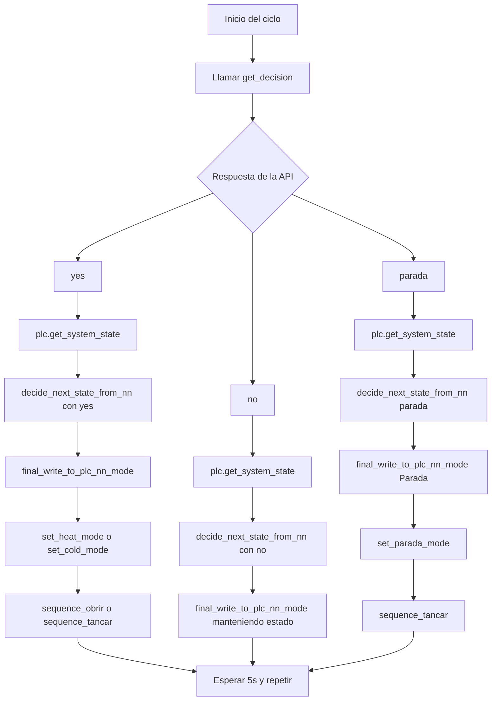

# Sistema de Control Térmico: Solar Heating & Radiative Cooling

Este proyecto implementa un sistema de control inteligente para una instalación solar-térmica y de radiative cooling.
El sistema tiene dos partes:

1. Una API de predicción (machine learning) que genera demanda y producción futuras.
2. El software de control que toma decisiones en tiempo real y comunica estados al PLC mediante SNAP7.

## Instalación

### Crear entorno virtual
```
python -m venv venv
```

### Instalar dependencias
```
pip install -r requirements.txt
```

## Ejecución

### 1. Iniciar API de predicción
```
python -m api.main
```

### 2. Iniciar software de control
```
python -m sc.main_vitor
```

## Funcionamiento del algoritmo

El sistema opera en dos modos:
- HOT (7:00–18:59): genera calor aprovechando radiación solar.
- COLD (19:00–06:59): genera frío mediante radiative cooling nocturno.

Cada día calcula demanda y producción prevista, selecciona franjas óptimas y cada 5 segundos decide si encender, mantener o parar el sistema. Se supervisan alarmas de lluvia y viento que pueden forzar cierre inmediato.

## Ciclo principal (diagrama)




```
Preguntar Albert
# ---------------------------------------------------------------------------
# Mapa lógico de variables -> VarName(s) reales + CSV donde buscar
#   source: ruta completa al CSV
#   varnames: lista de posibles nombres en la columna VarName
# ---------------------------------------------------------------------------
VARIABLE_SOURCES = {
    "hot": {
        "varnames": ["TempT6_RCEa", "TempT6_RCEa_v2"],
        "source": lect_dir,   # temperatura caliente
    },
    "cold": {
        "varnames": ["TempT9_RCEa", "TempT9_RCEa_v2"],
        "source": lect_dir,   # temperatura fría
    },
    "v_vent": {
        "varnames": ["VelVent_RCEa", "VelVent_RCEa_v2"],
        "source": lect_dir,   # velocidad viento
    },
    "solar": {
        "varnames": ["IO_SENSOR1_DATA_RCEa"],
        "source": solar_dir,  # radiación solar
    },
    "ir": {
        "varnames": ["E_FIR, neto, [W/m2]_RCEb"],
        "source": ir_dir,     # radiación IR neta
    },
}
```